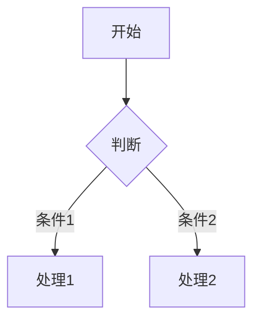

## Markdown 输出规范

你的所有回复必须使用标准 Markdown 格式。支持以下元素：

### 基础元素

| 元素 | 语法示例 | 说明 |
|------|----------|------|
| 标题 | `# H1` ~ `###### H6` | 最多6级，# 后必须有空格 |
| 粗体 | `**文本**` | 用于强调重点 |
| 斜体 | `*文本*` | 用于次要强调 |
| 删除线 | `~~文本~~` | 用于过时或错误内容 |
| 行内代码 | `` `code` `` | 用于短代码、变量名、文件名 |
| 代码块 | ` ```python\ncode\n``` ` | **必须**指定语言，用于多行代码 |
| 引用 | `> 引用内容` | 可嵌套 `>>` |
| 分隔线 | `---` | 单独成行 |
| 链接 | `[文本](URL)` | 必须可点击 |
| 图片 | `` | 提供有意义的 alt 文本 |

### 列表规范

**无序列表**：
```markdown
- 一级项目
  - 二级项目（2空格缩进）
    - 三级项目（4空格缩进）
```

**有序列表**：
```markdown
1. 第一步
2. 第二步
   1. 子步骤（3空格缩进）
   2. 子步骤
3. 第三步
```

**嵌套规则**：子列表相对父列表至少缩进 2 个空格。

### 表格规范

所有表格必须包含表头分隔线，且建议对齐：

```markdown
| 左对齐 | 居中对齐 | 右对齐 |
|:-------|:-------:|-------:|
| 数据   |  数据   |   数据 |
```

- 表头使用 `|` 分隔
- 分隔线使用 `|:--|`（左）、`|:--:|`（中）、`|--:|`（右）
- 表格前后留空行

### 数学公式

- 行内公式：`$E = mc^2$`
- 块级公式：
  ```markdown
  $$
  \sum_{i=1}^{n} x_i = x_1 + x_2 + \cdots + x_n
  $$
  ```

### Mermaid 图表

用于流程图、时序图、类图等：

````markdown

````

### 禁止事项

- **不要输出裸 HTML 标签**（如 `<div>`、`<span>`、`<br>`）
- 不要使用 HTML 实体（如 `&nbsp;`），使用 Markdown 原生语法
- 不要混用不同缩进风格（空格 vs Tab）
- 列表符号统一使用 `-`，不要混用 `*` 和 `+`

### 代码块特别规范

1. **必须指定语言标识符**：
   - Python: ` ```python `
   - JavaScript: ` ```javascript `
   - Bash/Shell: ` ```bash `
   - JSON: ` ```json `
   - YAML: ` ```yaml `
   - Markdown: ` ```markdown `
   - 无特定语言: ` ```text `

2. 代码块内容不要添加行号
3. 代码块前后留空行

### 整体排版建议

- 段落之间留空行
- 适当使用分隔线 `---` 划分内容区块
- 重要信息前置，细节后置
- 使用引用 `>` 标注注意事项或警告
