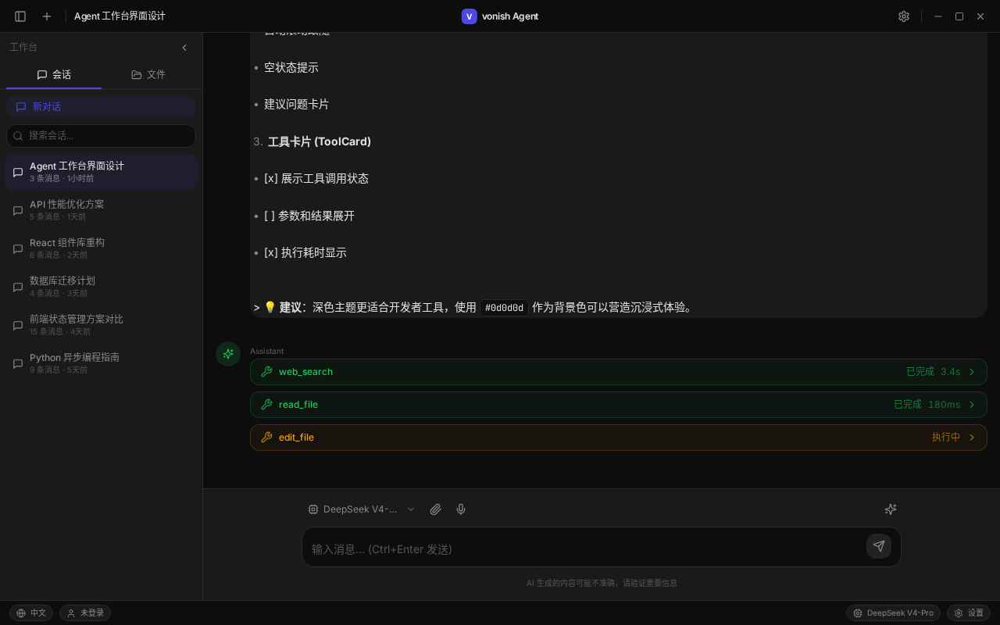
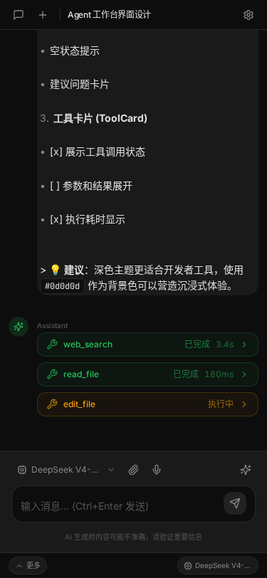

# Frontend Preview

## 界面概览

Agent 工作台采用深色极简风格（参考 Claude Code），主要区域：

- **顶部栏**：品牌名 "vonish Agent" + 窗口控制
- **左侧边栏**：可拖拽/可收起，含会话列表 + Workspace 文件树 + 搜索
- **主内容区**：消息流（文字 → Thinking Card → Tool Card → 文字）
- **底部 Composer**：输入框 + 附件 + 模型切换 + 上下文管理
- **左下角状态栏**：Language / Account / Settings

## 已实现功能

### 布局
- [x] 桌面端完整布局（侧边栏 + 主区域 + 状态栏）
- [x] 移动端响应式（抽屉式侧边栏 + 折叠布局）
- [x] 侧边栏可拖拽调整宽度（200-350px）
- [x] 侧边栏可完全收起 + 悬停临时展开
- [x] 深色主题（#0d0d0d 背景）

### 聊天
- [x] 消息流式渲染
- [x] 用户/AI 消息气泡区分
- [x] Thinking Card（可折叠思考过程）
- [x] Tool Card（带状态颜色：等待/执行中/成功/失败）
- [x] Markdown 全家桶渲染（代码块/表格/列表/引用）
- [x] 代码块复制按钮
- [x] Workspace Diff 展示（新增/修改/删除）

### 输入区
- [x] 多行输入框（自动增高，Enter 发送）
- [x] 附件横向铺排 + 删除
- [x] 模型切换下拉（DeepSeek V4-Pro / Kimi K2.6）
- [x] 上下文管理面板（Token 仪表盘 + Profile 切换）
- [x] 删除对话 / 导出 / 上下文管理按钮
- [x] 语音按钮占位

### 状态管理
- [x] Zustand 会话/消息/Workspace/UI 状态
- [x] Mock 数据（6+ 会话、8+ 消息、文件树）

## 占位功能（UI 存在但未真实接入后端）
- [ ] 语音输入（按钮存在，功能未实现）
- [ ] 真实 SSE 流式（使用模拟数据）
- [ ] 真实文件上传（模拟上传流程）
- [ ] 真实工具调用（模拟工具执行）

## 截图

### 桌面端

### 移动端

## 待完善
1. 真实 SSE 接入后端
2. 真实文件上传 API 对接
3. 真实工具调用闭环
4. 数学公式渲染（KaTeX）
5. Mermaid 图表渲染
